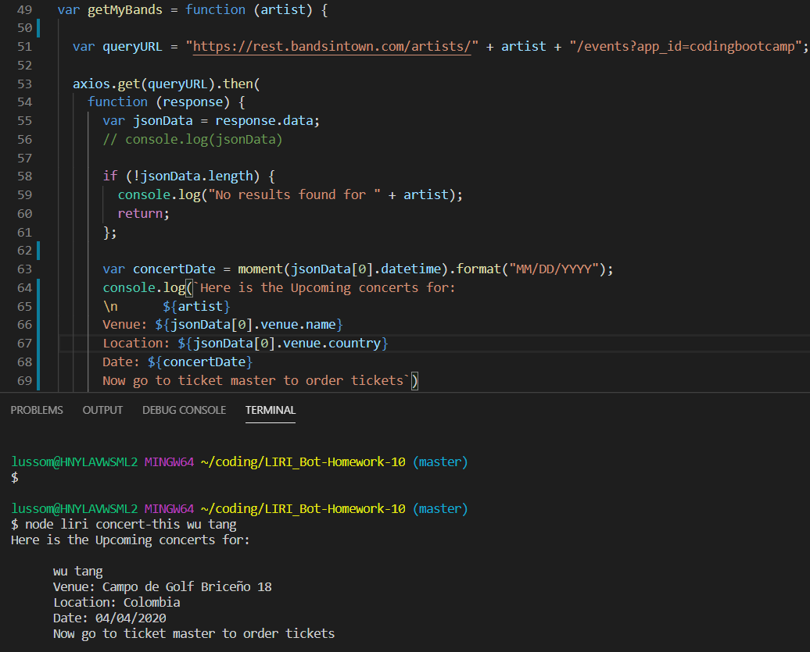
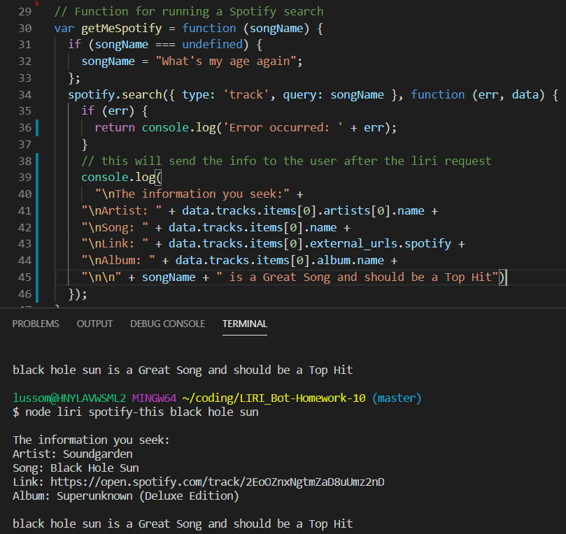
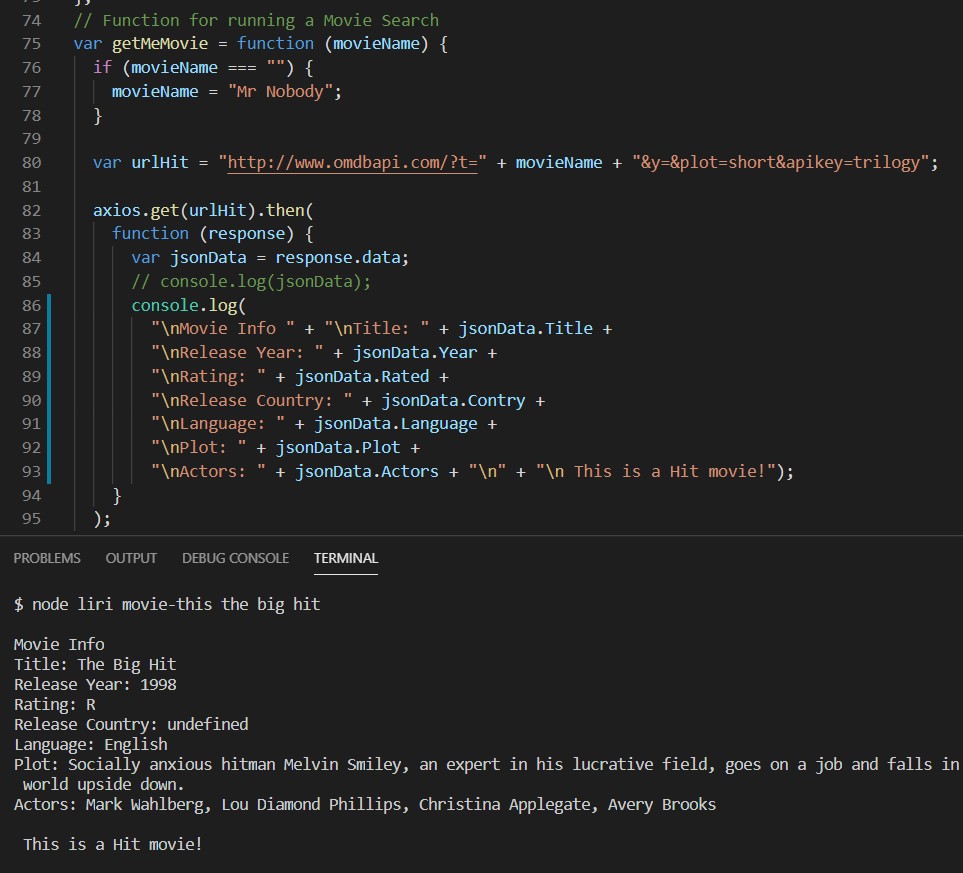

# LIRI_Bot-Homework-10
LIRI will search Spotify for songs, Bands in Town for concerts, and OMDB for movies.

1. Clearly state the problem the app is trying to solve (i.e. what is it doing and why)
    ## LIRI_Bot
    The LIRI bot will allow the user to search for reconigized songs, and upcoming concerts for the the bands that the user will 
    looking for.
    Additional features are that the app will search data bases for the information on the movies the user requested

2. Give a high-level overview of how the app is organized
    ## Over view of the LIRI_bot app, and how it is orgainzed
        The app will allow the user to search songs, concerts, and movies with a series of commands:
        
   * `concert-this`
    info of the Venu, venu location, and date of the concert at each venu
   * `spotify-this-song`
    Info of the Artist or Artists of the songs, the Song's name, a preview link of the song, and the Album the song is presented on

   * `movie-this`
    The info given will be presented:  Title and Year the movie came out, the IMDB Rating of the movie along with Rotten Tomatoes Rating of the movie.  The Country where the movie was produced with Language of the movie and Plot of the movie along with the Actors in the movie.

   * `do-what-it-says`
   
   By utilizing these commands, the app will search and give responces of it's findings from establized data bases using APIs.

3. Give start-to-finish instructions on how to run the app
    ## Using the App
    1. make sure to user loades the required packages for running this app 
        a. you can perform a npm install (you will get all the dependencies requried)
    2. run node liri.js 
        * a. `concert-this` "Name of band"
             this will send back the info of the Next scheduled locaton of the Bands concert location and date
        * b. `spotify-this` "name of song"
            this will send back info about the song and link on spotify for the song file
        * c. `movie-this` "name of movie" 
            this will give the info about the movie request and actors that play in the move 

4. Include screenshots, gifs or videos of the app functioning
    ### concert-this request
    

    ### spotify-this request
    

    ### movie-this request
    
    
5. Contain a link to a the GitHub Rep
    https://github.com/Mlusso06/LIRI_Bot-Homework-10
    [GitHub](https://github.com/Mlusso06/LIRI_Bot-Homework-10)

6. Clearly list the technologies used in the app
    ### list of Technologies used in develping the App
        Node.js, java

7. State your role in the app development\
    ### My role in the app development
        I completed the app based on the directions of the Homework presented for #10, for Bootcamp
        This was to devlope the working app using Node.js, and the working api from varius locations
